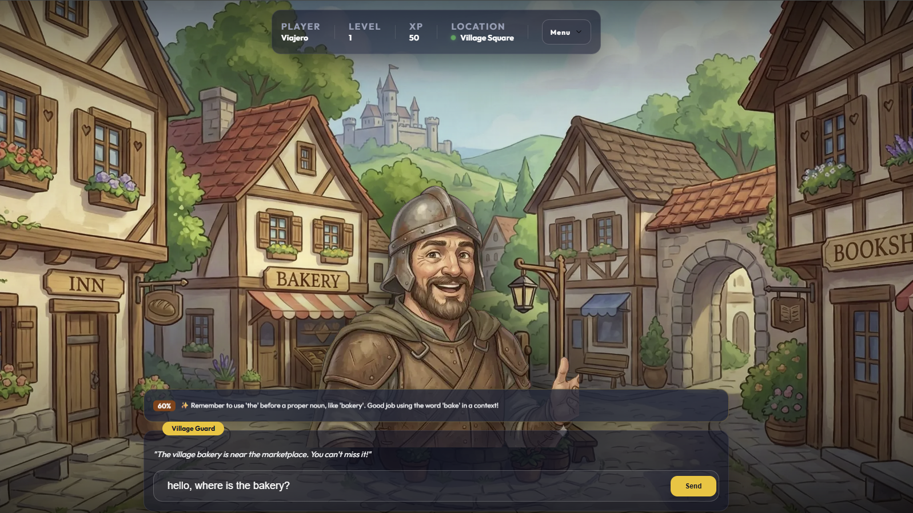
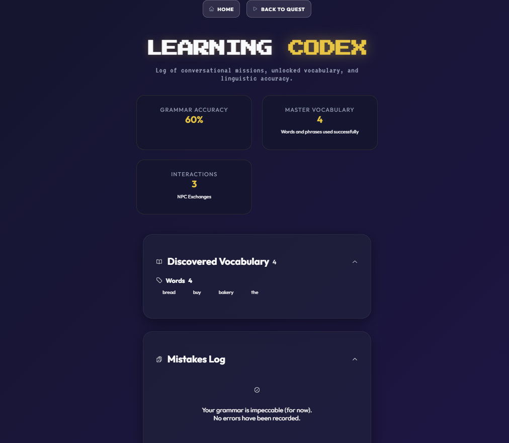

<div align="center">
  <h1>🌍 The Polyglot Path</h1>
  <p><strong>An AI-Powered Narrative RPG for Immersive Language Learning</strong></p>

  <!-- Badges -->
  <p>
    <a href="https://github.com/nuxt/nuxt"></a>
    <a href="https://www.typescriptlang.org/"></a>
    <a href="https://firebase.google.com/docs/genkit"></a>
    <a href="https://orm.drizzle.team/"></a>
    <a href="https://www.docker.com/"></a>
    <br>
    <a href="https://github.com/tu-usuario/polyglot-path/releases"></a>
    <a href="LICENSE"></a>
  </p>

  <p>
    <a href="README.md">🇪🇸 Español</a> | 🇬🇧 <b>English</b>
  </p>

  <h3>🎮 <a href="https://polyglot.jassdev.tech">Play now in Production! (Live Demo)</a> 🎮</h3>
</div>

<p align="center">
  
  &nbsp;&nbsp;&nbsp;
  
</p>

---

**The Polyglot Path** is a web-based narrative RPG designed for immersive language learning. The player learns by interacting in natural language with AI-powered NPCs (Non-Playable Characters). 

Originally born as a Master's Thesis (TFM) project focused on the application of language models in gamified educational environments, the system is built under a **Data-Driven** philosophy. All narrative content resides in structured JSON files, achieving massive scalability and direct integration with AI-managed pedagogical workflows.

## 📑 Table of Contents

- [✨ Key Features](#-key-features)
- [🛠️ Technology Stack](#️-technology-stack)
- [🚀 Getting Started](#-getting-started)
- [💻 Quick Usage Guide](#-quick-usage-guide)
- [📚 Documentation](#-documentation)
- [🤝 Contributing](#-contributing)
- [📄 License](#-license)
- [👏 Credits](#-credits)

---

## ✨ Key Features

* **🎙️ Intelligent AI Dialogue:** Dynamic conversations with NPCs that evaluate your grammar, maintain their personality, and react to your intents in real-time.
* **🧠 Pedagogical Telemetry (Learning Codex):** A dashboard analyzing grammar precision (Grammar Score), learned words, and verb tense frequency.
* **🤖 Multi-Provider LLM:** *Plug-and-play* support for multiple engines:
  * **Google AI:** Gemini 2.0 Flash/Pro (Cloud - Best reasoning).
  * **Groq:** Llama 3.1 8B (Cloud - Maximum speed).
  * **Ollama:** phi4-mini / llama3 (Local - 100% private and offline).
* **📜 Narrative Quest Engine:** Progression through stories chained by communicative goals (e.g., checking into a hotel, negotiating a reservation).
* **🎒 Inventory & Rewards:** Immersive interface (HUD) to manage experience (XP), levels, and acquired items.
* **🛡️ Dual Moderation (Safety):** Deterministic local filter for +120 banned terms combined with AI semantic safety guards.

---

## 🛠️ Technology Stack

The project follows a modern **Monorepo** architecture, bridging Frontend and Backend in the same development environment ensuring End-to-End Type Safety.

- **Frontend:** [Nuxt 4](https://nuxt.com/) (Vue 3, [Pinia](https://pinia.vuejs.org/) for reactive state management, Nuxt UI for components and accessibility).
- **Backend:** [Nitro](https://nitro.unjs.io/) (Nuxt's native server engine) providing REST APIs, validation, and AI logic.
- **AI Orchestration:** [Firebase Genkit](https://firebase.google.com/docs/genkit) for agents, flows, prompts, and *Structured Outputs* (strict JSON outputs).
- **Database:** PostgreSQL 16 + [Drizzle ORM](https://orm.drizzle.team/) for fast and typed persistence.
- **Infrastructure:** Docker and Docker Compose for *Zero-Touch* automated deployment.
- **Code Quality:** Husky (Hooks), ESLint, SonarJS, Vitest.
- **Architecture**: Full decoupling (Data, Logic, UI).

---

## 🏗️ Architecture & Decoupling

The project is designed following principles of **High Cohesion** and **Low Coupling**, allowing each layer to remain independent:

### 📂 Key Directory Structure

```text
polyglot-path/
├── app/                  # Frontend: Vue pages, Components, Layouts & UI Interface
├── game-data/            # JSON Data: NPCs, Stories, Locations, Missions & Items
├── server/               # Backend (Nitro): API Endpoints, DB Initialization & Models
│   ├── api/              # REST API Routes (Auth, Game, Interact)
│   ├── ai/               # Genkit Configuration, Prompts & LLM Orchestration
│   ├── db/               # Database Schemas & connection configurations
│   └── utils/            # Validation logic, string handling & server state
├── Dockerfile            # Recipe to build the App's production image
├── docker-compose.yml    # Container orchestration (Web App & Database)
└── nuxt.config.ts        # Main framework configuration (Nuxt 4)
```

### 📄 Content-Driven Architecture (Data)
All the game "world" logic is defined in JSON files within the `game-data/` folder. This includes NPCs, missions, stories, and dialogues.
- **Independence**: New stories can be added or the entire game can be translated simply by editing JSONs, **without the need for programming** or recompiling the application.
- **Dynamic Loading**: The server loads this data at runtime transparently (`server/utils/loadGameData.ts`).

### 🧠 Server-Side Intelligence (Logic)
All heavy logic resides in the backend (Nuxt Nitro + Google Genkit).
- **Decoupled AI**: Prompts, language validation schemas, and mission logic are centralized on the server to ensure the client never has access to API Keys or AI decision logic.
- **Persistence**: The database stores the player's state independently from the interface.

### 🎨 Reactive Client (UI)
The frontend (Nuxt 4 + Pinia) acts as a "Thin Client".
- **Synchronized State**: It only stores and displays the current state provided by the server, which greatly simplifies testing and interface scalability without breaking the game's core logic.

---

## 🛠️ Quality & Development Standards

This project implements a "Zero Errors" workflow through automated quality tools:

### 🛡️ Code Quality (Quality Gate)
- **ESLint (v10)**: Configured with support for Nuxt 4, Vue 3, and TypeScript.
- **SonarJS**: Integrated directly into the linter to detect *Code Smells*, security vulnerabilities, and excessively complex logic.
- **TypeScript**: Strict typing across the whole project (`npx nuxi typecheck`).

### ⚓ Git Hooks (Husky)
We have configured **Husky** to automatically run the following validations before every `commit`:
1. **Lint-staged**: Runs `eslint --fix` only on modified files. If quality or security issues (Sonar rules) are detected that cannot be auto-fixed, the commit is aborted.
2. **Type-check**: Validates that there are no TypeScript errors in the entire project.

### 🧪 Unit Testing
- **Vitest**: Test suite for server logic, components, and stores.
- **Coverage**: You can generate code coverage reports by running:
  ```bash
  pnpm test:coverage
  ```

### 🗄️ Visual Database Management
- **Drizzle Studio**: You can explore and modify your local database data visually by running:
  ```bash
  pnpm db:studio
  ```

### 🧠 AI Development Environment
- **Genkit UI**: The AI development workflow is integrated with Google Genkit, allowing you to test prompts and AI flows in real-time on your development instance:
  ```bash
  pnpm dev
  ```
  This will open both the application and the Genkit Control Panel to debug LLM model responses.

---

## 🚀 Getting Started

### Prerequisites

- [Docker](https://www.docker.com/) and Docker Compose installed.
- Node.js 22 LTS and `pnpm` (only if you plan to develop features outside containers).

### 1. Environment Setup

Clone the repository and prepare your environment variables file:

```bash
git clone https://github.com/your-user/polyglot-path.git
cd polyglot-path
cp .env.example .env
```
*(Make sure to include your API Keys in the `.env` if using Cloud providers, or change `LLM_PROVIDER` to ollama).*

### 2. Zero-Touch Deployment (Docker)

The project is configured for a painless startup. The database, migrations, and interfaces will spin up automatically:

```bash
docker compose up -d
```

*(Prefer offline, local AI? Run `docker compose --profile ollama up -d` instead).*

The main application will be available within seconds at [http://localhost:3000](http://localhost:3000).

---

## 💻 Quick Usage Guide

The Dockerized environment exposes the following key ports to your host machine:

| Service | Access Route | Description |
| :--- | :--- | :--- |
| **Video Game (App)** | [`http://localhost:3000`](http://localhost:3000) | Main application featuring Hot-Reload for development. |
| **Database Panel** | [`http://localhost:5050`](http://localhost:5050) | pgAdmin 4 (User: `admin@polyglot.com` / Pass: `admin123`). |
| **Genkit AI Debug** | [`http://localhost:4000`](http://localhost:4000) | Visual developer tool to trace AI calls and workflows. |

### Frequent Commands

```bash
# View live logs of the web server
docker compose logs -f polyglot-app

# Restart the application after changing an environment variable
docker compose restart polyglot-app

# Turn off all services without deleting data
docker compose down

# Turn off services and COMPLETELY WIPE the database
docker compose down -v
```

---

## 📚 Documentation

For developers, *Game Designers*, or contributors looking to dive into the architecture or create new content:

- 📖 **[How to create new stories and NPCs](docs/CreateNewStories.md)**: Syntactic guide for the JSON engine.
- ⚙️ **[Docker Deployment & Troubleshooting](docs/Docker_Deployment.md)** ([🇪🇸 Spanish Guide](docs/Despliegue_Docker.md)): Detailed infrastructure guide.

---

## 🤝 Contributing

We love contributions! `Polyglot Path` version 1.0.0 is open-source software.
Feel free to discuss new structural proposals, open *Issues* for bugs, or submit a *Pull Request*.

1. Fork the project.
2. Create your feature branch (`git checkout -b feature/AmazingFeature`).
3. Commit your changes with standard semantics (`git commit -m 'feat: add test NPC'`).
4. Push to the branch (`git push origin feature/AmazingFeature`).
5. Open a **Pull Request**.

Please make sure your changes pass the tests (`pnpm test`) and linting rules before submitting your proposal.

---

## 📄 License

This project is distributed under the open-source **MIT License**. See the `LICENSE` file for more information.

It is free and valid for educational, academic, or commercial use.

---

## 👏 Credits

**Developed and maintained by:** [Juan Antonio Sánchez Santamaría]  
*Originally created as a Master's Thesis Project.*

<div align="center">
  <sub>Built with ❤️ bridging philology and artificial intelligence.</sub>
</div>
